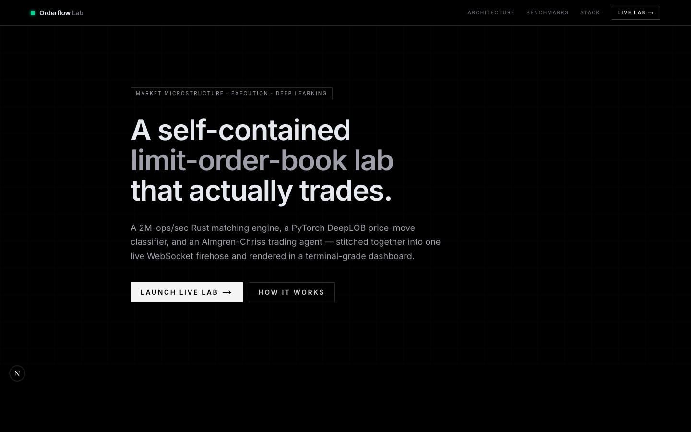
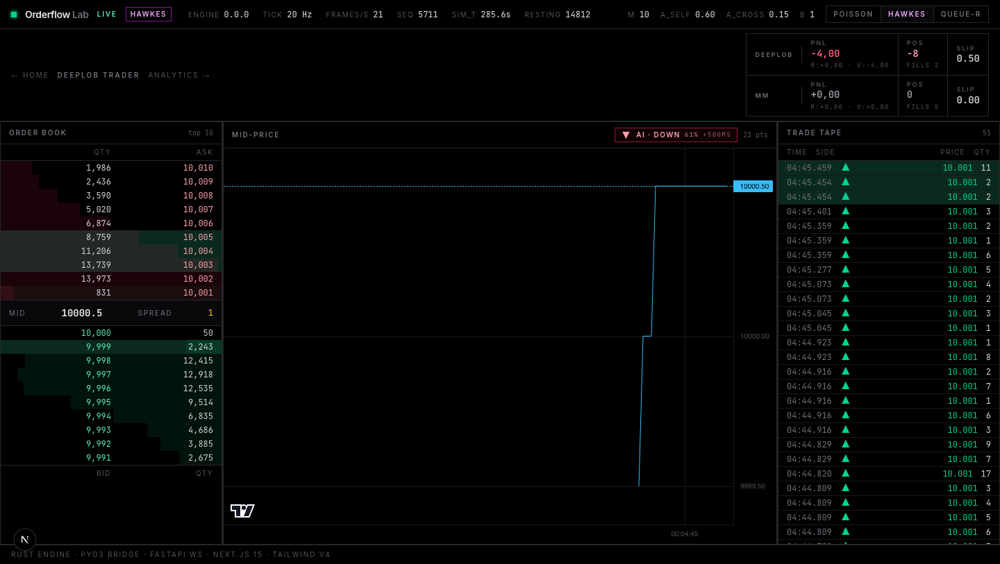
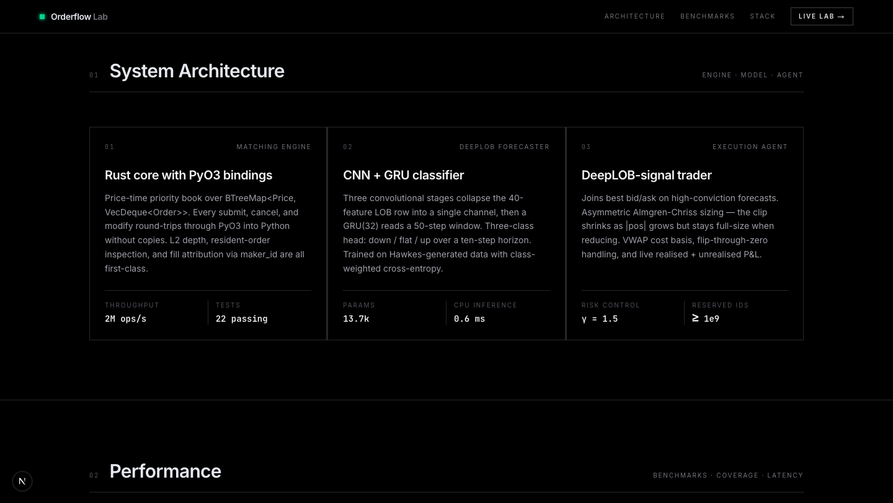
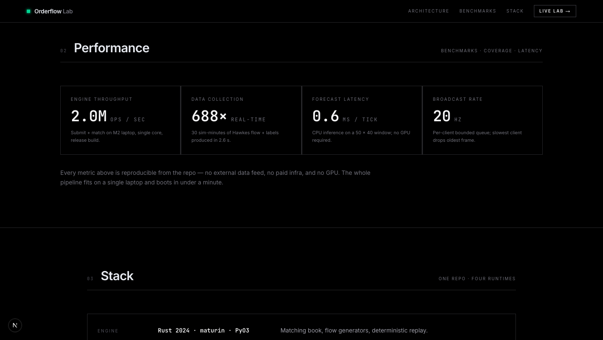
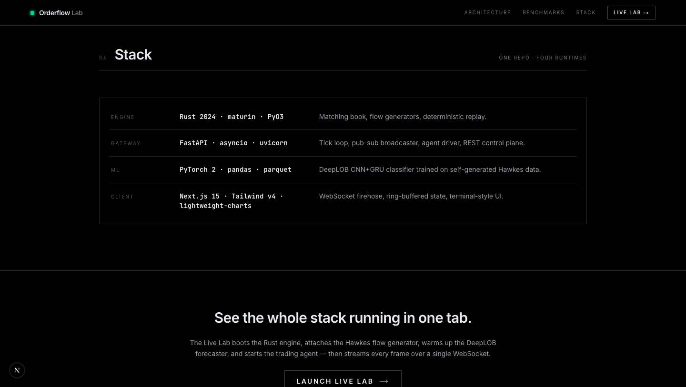

# Orderflow Lab

A self-contained market-microstructure simulator. A 2M-ops/sec Rust matching engine, a PyTorch DeepLOB price-move classifier, and an Almgren-Chriss execution agent — stitched together into one live WebSocket firehose and rendered in a terminal-grade dashboard.



---

## The live dashboard

The `/lab` page is the whole system running in one tab. Rust engine ticking at 20 Hz, Hawkes flow generator firing, DeepLOB classifier emitting `AI · DOWN 61% +500ms` forecasts, and two agents (DeepLOB trader + a passive market-maker) trading their own books side-by-side with live P&L, positions, and slippage.



---

## Architecture

Three cooperating components, each benchmarked individually and wired together over an in-process channel.



| Layer | Tech | What it does |
|---|---|---|
| **Engine** | Rust 2024 · PyO3 · maturin | Price-time priority limit-order book. `BTreeMap<Price, VecDeque<Order>>`, L2 depth, resident-order inspection, fill attribution via `maker_id`. 22 unit tests. |
| **Gateway** | FastAPI · asyncio · uvicorn | Tick loop, pub-sub WebSocket broadcaster, agent driver, REST control plane. |
| **Forecaster** | PyTorch 2 · pandas · parquet | DeepLOB CNN+GRU classifier (13.7k params) trained on self-generated Hawkes data. 0.6 ms CPU inference per 50×40 window. |
| **Client** | Next.js 15 · Tailwind v4 · lightweight-charts | WebSocket firehose, ring-buffered state, terminal-style UI. |

## Performance



Every metric is reproducible from the repo — no external data feed, no paid infra, no GPU. The whole pipeline boots on a single laptop in under a minute.

---

## Quickstart

> **Full guide with troubleshooting: [INSTALL.md](INSTALL.md).** The short version below works on a clean macOS or Linux shell that has Rust, Python 3.12, Node ≥ 20, and pnpm already installed.

### 1. Clone

```bash
git clone https://github.com/samuel29102002/orderflow-lab.git quant
cd quant
```

### 2. Python venv (not Conda)

If you have Conda installed, its `CONDA_PREFIX` will poison `PATH` and `maturin` will build against the wrong Python. Neutralise it first:

```bash
conda deactivate 2>/dev/null || true
unset CONDA_PREFIX CONDA_DEFAULT_ENV CONDA_SHLVL

python3.12 -m venv .venv
source .venv/bin/activate
which python    # must end in .venv/bin/python
```

### 3. Python deps

```bash
pip install --upgrade pip wheel
pip install 'maturin[patchelf]'
pip install -e packages/sdk-py -e services/api
pip install torch pandas pyarrow
```

### 4. Build the Rust engine (PyO3 → venv site-packages)

```bash
cd services/engine/py
maturin develop --release
cd ../../..

# Smoke test
python -c "from orderflow_sdk import Engine, Side; \
  e = Engine(); r = e.submit(Side.Bid, 100, 5); print('engine ok:', r)"
# → engine ok: SubmitResult(order_id=1, trades=[])
```

### 5. JS deps

```bash
pnpm install
```

### 6. Run the stack — two terminals

Both terminals need the venv activated. The API must be running for the dashboard to show anything but a "reconnecting" badge — that was the most common setup pitfall.

**Terminal A — FastAPI gateway on :8000**

```bash
source .venv/bin/activate
cd services/api
ORDERFLOW_SIM_GENERATOR=hawkes uvicorn app.main:app --reload --port 8000
```

Wait for `simulation started: tick_hz=20.0 speed=1.0 generator=hawkes`, then sanity-check:

```bash
curl http://127.0.0.1:8000/health
# → {"status":"ok", ..., "generator":"hawkes", ...}
```

**Terminal B — Next.js dashboard on :3000**

```bash
pnpm --filter @orderflow/web dev
```

### 7. Open the browser

- Landing page: <http://localhost:3000>
- Live lab: <http://localhost:3000/lab>

With Hawkes selected and the API up, the DeepLOB trader should start firing within ~5 seconds and you'll see P&L tick in the top-right.

### Optional — train your own DeepLOB checkpoint

A 60 KB pretrained `research/artifacts/deeplob.pt` ships with the repo, so the forecaster works out of the box. To retrain on fresh data:

```bash
python research/collect_data.py     # 30 sim-minutes of Hawkes data in ~2.6 s
python research/train_deeplob.py    # ~2 min on CPU
```

### Optional — Postgres + Redis (for persistence)

Only needed if you want snapshot persistence; the live loop is in-memory.

```bash
docker compose -f infra/docker/docker-compose.yml up -d
```

---

## Configuration

All server-side config is `pydantic-settings` prefixed `ORDERFLOW_`. Drop them in `services/api/.env` or export them:

```bash
# Simulator
ORDERFLOW_SIM_GENERATOR=hawkes          # poisson | hawkes | queue_reactive
ORDERFLOW_SIM_TICK_HZ=20

# Agent (DeepLOB trader)
ORDERFLOW_AGENT_ENABLED=true
ORDERFLOW_AGENT_THRESHOLD=0.70          # min forecast confidence to place
ORDERFLOW_AGENT_BASE_CLIP=5
ORDERFLOW_AGENT_MAX_POS=50
ORDERFLOW_AGENT_RISK_AVERSION=1.5       # γ in asymmetric Almgren-Chriss sizing
```

Client-side: `NEXT_PUBLIC_WS_URL` and `NEXT_PUBLIC_API_URL` in `apps/web/app/lib/config.ts` if the API is on a different host.

---

## Repository layout

```
quant/
├── apps/web/                 # Next.js 15 dashboard + landing page
├── services/
│   ├── engine/               # Rust matching engine + PyO3 crate
│   └── api/                  # FastAPI gateway, broadcaster, agent driver
├── packages/
│   ├── sdk-py/               # Python strategy SDK (DeepLOBAgent, MMAgent, …)
│   ├── sdk-ts/               # Typed TS client for the WS firehose
│   ├── schema/               # Shared Pydantic + Zod models
│   └── ui/                   # Shared React components
├── research/
│   ├── collect_data.py       # Generate Hawkes + labels
│   ├── train_deeplob.py      # CNN+GRU trainer
│   └── artifacts/deeplob.pt  # 60 KB shipped checkpoint
├── infra/docker/             # Postgres + Redis compose for persistence
├── INSTALL.md                # Full setup + troubleshooting guide
├── FINAL_STATE.md            # Architecture deep-dive
└── PROJECT_DESIGN.md         # Original design document
```

## Tests

```bash
cargo test --manifest-path services/engine/Cargo.toml    # 22 Rust tests
pytest packages/sdk-py/tests                             # 45 Python SDK tests
cd services/api && pytest tests                          # FastAPI health test
```

All three suites should be green. See [INSTALL.md §6](INSTALL.md) for why the two Python suites must run separately.

---

## Stack



Built solo. No affiliations. No paid infrastructure.
